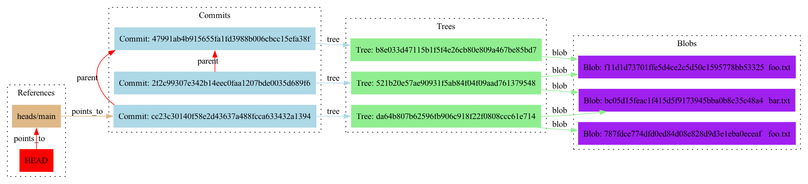

# Git object visualizer

Run this script in a Git repo to output a Graphviz graph of the repo's objects.

```
$ cp ~/Downloads/generate-graphviz.sh
$ chmod +x generate-graphviz.sh

# Run inside a repo with a .git.
$ ./generategenerate-graphviz.sh
Graphviz output generated in git_graph.dot
$ dot -Tpng git_graph.dot > output.png
```

Example graph, with two commits accessible from HEAD, and one dangling commit:



Check out the [blog post](https://polarbeardomestication.net/posts/notes3.html) for more details!

